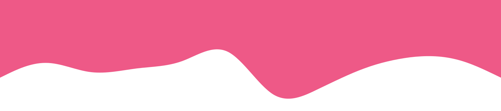

<h1> Hello! I'm Giuseppe 👋🏻 🧑🏻‍💻</h1>

<section id="badge-container">

</section>
I'm a front-end engineer currently working with <b>DST</b> and <b>Accenture</b>.

I have developed apps for companies all over Italy and I have collaborated with entrepreneurs who, thanks to my works, have reached and exceeded their goals.  

"Do it... better" is the philosophy with which I approach each project.

### TL;DR
<section style="font-size: 18px;">
<ul>
<li>

Front-end engineer <a href="https://dstech.it" target="_blank">@dst</a>

</li>
<li>

Currently working for <a href="https://accenture.com" target="_blank">@Accenture</a>

</li>
<li>

React, Type/Javascript, Clojure

</li>
</ul>
</section>

